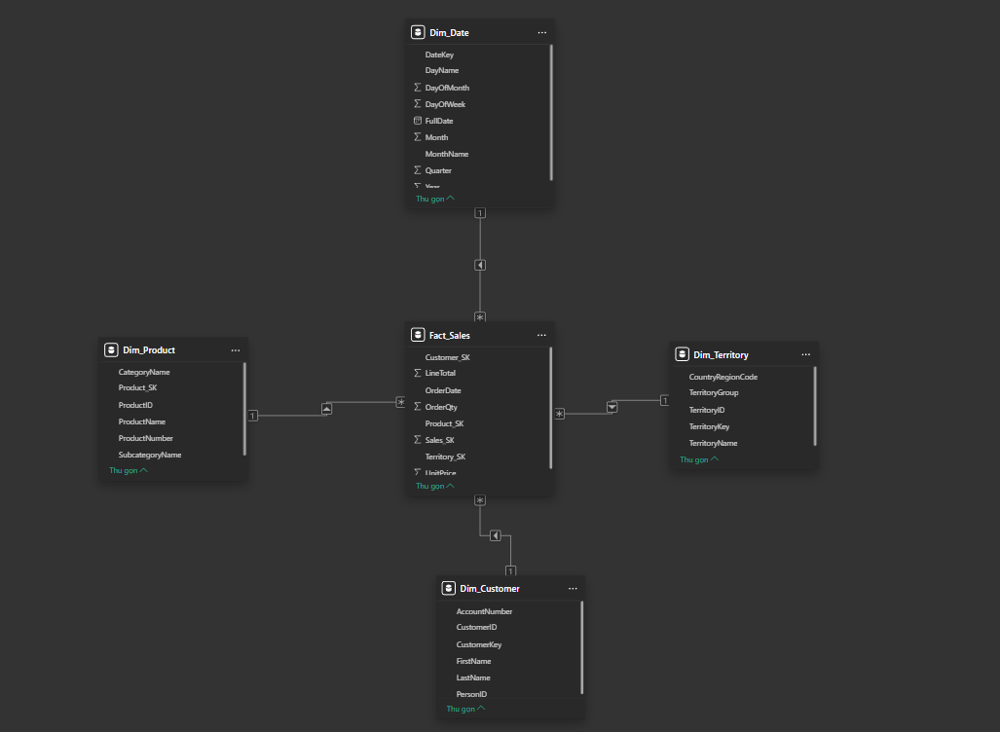
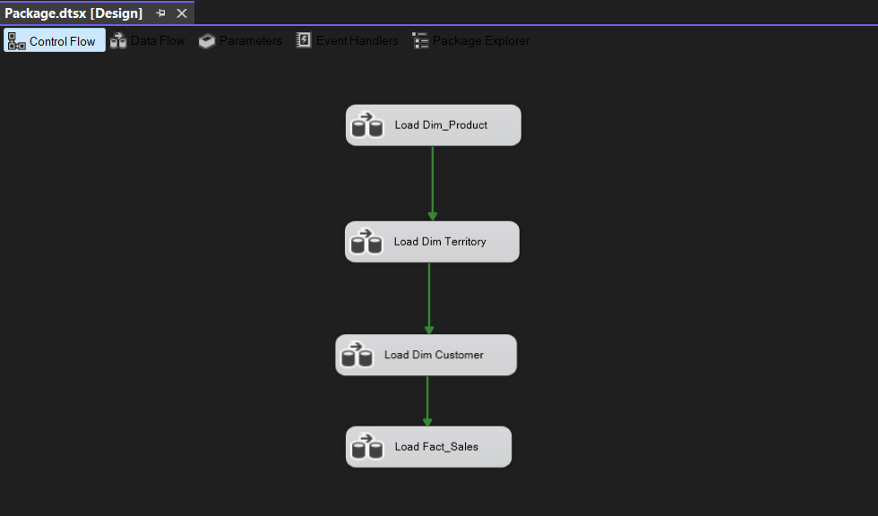
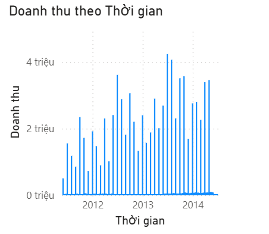

# 📊 Dự án Data Engineering: Phân tích Doanh thu và Bán hàng (Sales & Revenue)

## 📝 Giới thiệu chung
Dự án này xây dựng một luồng dữ liệu (Data Pipeline) tự động để trích xuất, biến đổi và tải (ETL) dữ liệu bán hàng. Mục tiêu là xây dựng một Data Warehouse phục vụ cho việc phân tích, báo cáo doanh thu và trực quan hóa dữ liệu.

## 🛠 Công nghệ sử dụng
* **Hệ quản trị cơ sở dữ liệu:** SQL Server
* **Công cụ ETL:** SQL Server Integration Services (SSIS) - Visual Studio
* **Công cụ trực quan hóa (BI):** Power BI
* **Nguồn dữ liệu (Dataset):** AdventureWorks (hoặc tên dataset thực tế của bạn)

## 🏗 Kiến trúc dữ liệu (Data Architecture)

Dự án áp dụng mô hình thiết kế **Star Schema** cho Data Warehouse, bao gồm:
* **Fact Table:** `Fact_Sales` (Lưu trữ các độ đo về doanh thu, số lượng bán, chiết khấu...)
* **Dimension Tables:** `Dim_Date`, `Dim_Product`, `Dim_Customer`, `Dim_Location`...

## 🔄 Luồng xử lý ETL (ETL Workflow)

Luồng SSIS (`.dtsx`) thực hiện các bước sau:
1. **Extract:** Rút trích dữ liệu từ hệ thống nguồn (Database/Flat files).
2. **Transform:** * Làm sạch dữ liệu (Xử lý Null, chuẩn hóa định dạng ngày tháng).
   * Lookup các Surrogate Keys từ các bảng Dimension.
   * Tính toán các trường dữ liệu phái sinh (Derived columns).
3. **Load:** Đổ dữ liệu đã làm sạch vào các bảng trong Data Warehouse.

## 🚀 Hướng dẫn cài đặt và chạy dự án

### Yêu cầu hệ thống (Prerequisites)
* SQL Server Management Studio (SSMS)
* Visual Studio (đã cài đặt extension *SQL Server Integration Services Projects*)
* Power BI Desktop

### Các bước thực thi
1. **Khởi tạo Database:** Chạy file script `Create_DataWarehouse.sql` trong SSMS để tạo các bảng Fact và Dimension.
2. **Cấu hình Connection:** Mở solution SSIS trong Visual Studio. Cập nhật lại các chuỗi kết nối (Connection Managers) trỏ về server SQL của bạn.
3. **Chạy ETL:** Thực thi (Start) các package theo thứ tự:
   * `Load_Dimensions.dtsx` (Đổ dữ liệu vào các bảng Dim trước)
   * `Load_Fact.dtsx` (Đổ dữ liệu vào bảng Fact sau)
4. **Xem báo cáo:** Mở file `Sales_Dashboard.pbix` bằng Power BI, chọn *Refresh* để cập nhật dữ liệu mới nhất từ Data Warehouse.

## 📈 Kết quả và Báo cáo trực quan

## 👨‍💻 Thông tin tác giả
* **Họ và tên:** Nguyễn Tiến Đạt
* **MSSV:** 20235674
* **Trường:** Đại học Bách khoa Hà Nội (HUST) - Khóa K68
